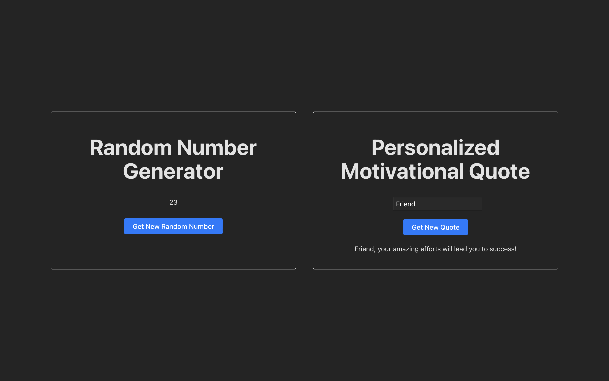

# React + Django



Simple app that uses React for the frontend, and Django for the backend.

There are 2 API endpoints: 
- Motivational Quote generator
- Random Number generator


## Run it!

Django:
```
python3 manage.py runserver
```

React:
```
npm run dev
```

Go to [localhost:5173](http://localhost:5173)!